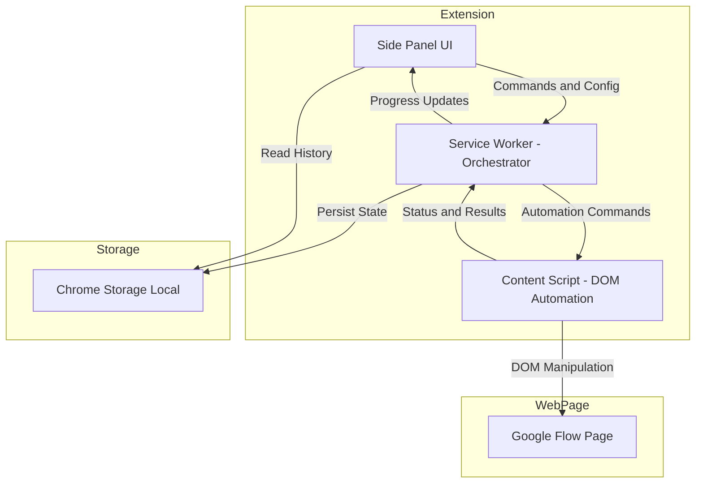
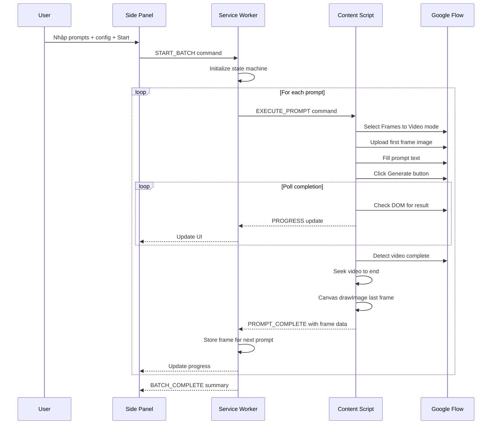
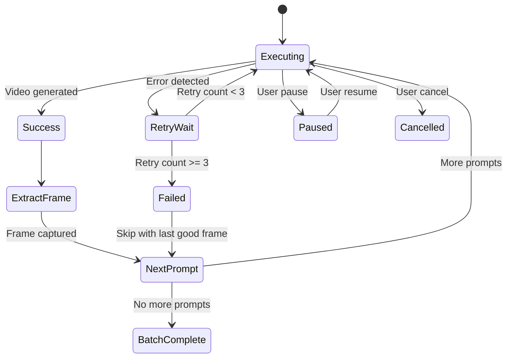

# Design Document — veo3-bulk-video

## Overview

**Purpose**: Extension tự động hóa quy trình tạo video hàng loạt trên Google Flow (Veo3), cho phép người dùng nhập danh sách prompt và extension tự động thực thi từng video, trích xuất frame cuối cùng để chain sang video tiếp theo — tạo chuỗi video liên tục mà không cần thao tác thủ công.

**Users**: Content creators, video producers cần tạo chuỗi video AI liên tục với visual continuity giữa các clip.

**Impact**: Giảm thời gian thao tác thủ công từ ~5 phút/video xuống tự động hoàn toàn. Đảm bảo visual continuity qua frame chaining.

### Goals
- Tự động hóa toàn bộ workflow tạo video trên Google Flow
- Chain video tự động qua last-frame extraction
- Giao diện trực quan theo dõi và điều khiển batch
- Xử lý lỗi thông minh, không gián đoạn chuỗi
- Lưu trữ lịch sử và kết quả

### Non-Goals
- Không xây dựng video editor hay post-processing
- Không hỗ trợ nền tảng khác ngoài Google Flow
- Không tích hợp API server-side (chỉ dùng local)
- Không hỗ trợ multi-tab parallel generation
- Không build cho Chrome Web Store (chỉ dùng local unpacked)

## Architecture

> Chi tiết discovery và lý do chọn giải pháp xem tại `research.md`.

### Architecture Pattern & Boundary Map

**Selected pattern**: 3-Layer Chrome Extension (Side Panel → Service Worker → Content Script)

Extension sử dụng kiến trúc MV3 chuẩn với 3 layer tách biệt, giao tiếp qua Chrome message passing:



**Domain boundaries**:
- **Side Panel**: UI rendering, user input, progress display — không chứa business logic
- **Service Worker**: Orchestration, state machine, error handling, retry logic — trung tâm điều phối
- **Content Script**: DOM interaction, frame extraction — chỉ thao tác page, không giữ state

### Technology Stack

| Layer | Choice / Version | Role in Feature | Notes |
|-------|------------------|-----------------|-------|
| Extension Runtime | Chrome Extension MV3 | Extension framework | Chrome 114+ required cho Side Panel |
| UI | HTML + CSS + Vanilla JS | Side Panel interface | Không cần framework — scope nhỏ, tránh build step |
| Orchestration | Service Worker JS | Batch state machine, message routing | Event-driven, dùng chrome.alarms để keep alive |
| DOM Automation | Content Script JS | Interact với Google Flow page | Isolated world, selector-based |
| Storage | chrome.storage.local | Persist prompts, config, history, state | Limit 10MB, đủ cho use case |
| Frame Capture | Canvas API | Extract last frame từ video element | Native browser API, không cần dependency |

## System Flows

### Main Batch Execution Flow



### Error Recovery Flow



## Requirements Traceability

| Requirement | Summary | Components | Interfaces | Flows |
|-------------|---------|------------|------------|-------|
| 1 | Quản lý danh sách prompt | PromptManager, SidePanelUI | IPromptManager, IPromptItem | — |
| 2 | Cấu hình ban đầu | ConfigManager, SidePanelUI | IBatchConfig | — |
| 3 | Tự động thực thi trên Google Flow | BatchOrchestrator, FlowAutomator | IFlowAutomator, IAutomationCommand | Main Batch Flow |
| 4 | Trích xuất frame và chain | FrameExtractor, BatchOrchestrator | IFrameExtractor | Main Batch Flow |
| 5 | Theo dõi tiến trình và điều khiển | BatchOrchestrator, SidePanelUI | IBatchState, IBatchControl | Main Batch Flow |
| 6 | Lưu trữ kết quả và lịch sử | HistoryManager | IHistoryManager, IBatchRecord | — |
| 7 | Xử lý lỗi và tự phục hồi | BatchOrchestrator, FlowAutomator | IRetryPolicy, IErrorLog | Error Recovery Flow |
| 8 | Giao diện Extension | SidePanelUI | ISidePanelState | — |

## Components and Interfaces

| Component | Domain/Layer | Intent | Req Coverage | Key Dependencies | Contracts |
|-----------|-------------|--------|-------------|-----------------|-----------|
| SidePanelUI | UI | Giao diện người dùng | 1, 2, 5, 8 | Service Worker (P0) | State |
| BatchOrchestrator | Service Worker | Điều phối batch execution | 3, 4, 5, 7 | FlowAutomator (P0), Storage (P1) | Service, State |
| FlowAutomator | Content Script | DOM automation trên Google Flow | 3, 4 | SelectorMap (P0) | Service |
| FrameExtractor | Content Script | Trích xuất last frame | 4 | Canvas API (P0) | Service |
| PromptManager | Service Worker | CRUD prompt list | 1 | Storage (P1) | Service, State |
| ConfigManager | Service Worker | Quản lý batch config | 2 | Storage (P1) | Service |
| HistoryManager | Service Worker | Lưu và truy vấn lịch sử | 6 | Storage (P1) | Service |
| SelectorMap | Content Script | CSS selector definitions cho Google Flow | 3 | — | — |

---

### Service Worker Layer

#### BatchOrchestrator

| Field | Detail |
|-------|--------|
| Intent | State machine điều phối toàn bộ batch execution lifecycle |
| Requirements | 3, 4, 5, 7 |

**Responsibilities & Constraints**
- Quản lý batch state machine (idle → running → paused → completed/cancelled)
- Điều phối tuần tự từng prompt: gửi command → chờ kết quả → chain frame → tiếp tục
- Xử lý retry logic khi prompt thất bại
- Persist state vào chrome.storage để recover khi Service Worker restart
- Dùng `chrome.alarms` để keep alive trong quá trình batch

**Dependencies**
- Outbound: FlowAutomator — gửi automation commands (P0)
- Outbound: PromptManager — đọc danh sách prompt (P0)
- Outbound: ConfigManager — đọc config (P1)
- Outbound: HistoryManager — lưu kết quả (P1)
- Outbound: chrome.storage — persist state (P0)

**Contracts**: Service [x] / State [x]

##### Service Interface
```typescript
interface IBatchOrchestrator {
  startBatch(promptIds: string[], config: IBatchConfig): Promise<void>;
  pauseBatch(): Promise<void>;
  resumeBatch(): Promise<void>;
  cancelBatch(): Promise<void>;
  getBatchState(): IBatchState;
}
```
- Preconditions: Google Flow tab phải đang mở và active
- Postconditions: Batch state được persist sau mỗi thay đổi
- Invariants: Chỉ có tối đa 1 batch chạy tại một thời điểm

##### State Management
```typescript
type BatchStatus = 'idle' | 'running' | 'paused' | 'completed' | 'cancelled';
type PromptStatus = 'pending' | 'generating' | 'completed' | 'error' | 'skipped';

interface IBatchState {
  status: BatchStatus;
  batchId: string;
  prompts: IPromptExecution[];
  currentIndex: number;
  lastSuccessfulFrame: string | null; // base64 data URL
  startedAt: number;
  completedAt: number | null;
  config: IBatchConfig;
}

interface IPromptExecution {
  promptId: string;
  text: string;
  status: PromptStatus;
  retryCount: number;
  extractedFrame: string | null;
  error: string | null;
  startedAt: number | null;
  completedAt: number | null;
}
```
- Persistence: chrome.storage.local, updated sau mỗi state transition
- Recovery: Khi Service Worker restart, load state từ storage và resume nếu batch đang running

---

#### PromptManager

| Field | Detail |
|-------|--------|
| Intent | CRUD operations cho danh sách prompt |
| Requirements | 1 |

**Contracts**: Service [x] / State [x]

##### Service Interface
```typescript
interface IPromptItem {
  id: string;
  text: string;
  order: number;
  createdAt: number;
}

interface IPromptManager {
  addPrompts(texts: string[]): Promise<IPromptItem[]>;
  updatePrompt(id: string, text: string): Promise<IPromptItem>;
  deletePrompt(id: string): Promise<void>;
  reorderPrompts(orderedIds: string[]): Promise<void>;
  getPrompts(): Promise<IPromptItem[]>;
  clearAll(): Promise<void>;
}
```

**Implementation Notes**
- Storage key: `prompts_list`
- ID generation: `crypto.randomUUID()`
- Bulk add: split input by newline, trim, filter empty

---

#### ConfigManager

| Field | Detail |
|-------|--------|
| Intent | Quản lý cấu hình batch |
| Requirements | 2 |

**Contracts**: Service [x]

##### Service Interface
```typescript
type AspectRatio = '16:9' | '9:16';

interface IBatchConfig {
  firstFrameImage: string | null; // base64 data URL
  aspectRatio: AspectRatio;
  delayBetweenGenerations: number; // ms, default 3000
  maxRetries: number; // default 3
  skipOnError: boolean; // default true
}

interface IConfigManager {
  getConfig(): Promise<IBatchConfig>;
  updateConfig(partial: Partial<IBatchConfig>): Promise<IBatchConfig>;
  resetConfig(): Promise<IBatchConfig>;
}
```

---

#### HistoryManager

| Field | Detail |
|-------|--------|
| Intent | Lưu trữ và truy vấn lịch sử batch |
| Requirements | 6 |

**Contracts**: Service [x]

##### Service Interface
```typescript
interface IBatchRecord {
  batchId: string;
  prompts: IPromptExecution[];
  config: IBatchConfig;
  startedAt: number;
  completedAt: number;
  successCount: number;
  errorCount: number;
}

interface IHistoryManager {
  saveBatchRecord(record: IBatchRecord): Promise<void>;
  getHistory(limit?: number): Promise<IBatchRecord[]>;
  deleteBatchRecord(batchId: string): Promise<void>;
  clearHistory(): Promise<void>;
  getStorageUsage(): Promise<{ used: number; total: number }>;
}
```

---

### Content Script Layer

#### FlowAutomator

| Field | Detail |
|-------|--------|
| Intent | DOM automation — thao tác giao diện Google Flow |
| Requirements | 3 |

**Responsibilities & Constraints**
- Query DOM elements qua SelectorMap
- Thực thi sequence: chọn mode → upload image → nhập prompt → nhấn generate
- Poll DOM để detect video completion
- Không giữ state — stateless, nhận command và trả result

**Dependencies**
- Inbound: BatchOrchestrator — nhận commands qua message passing (P0)
- External: SelectorMap — CSS selectors cho Google Flow elements (P0)
- External: FrameExtractor — trích xuất frame từ video (P0)

**Contracts**: Service [x]

##### Service Interface
```typescript
interface IAutomationCommand {
  type: 'SELECT_MODE' | 'UPLOAD_IMAGE' | 'FILL_PROMPT' | 'CLICK_GENERATE' | 'WAIT_COMPLETION' | 'EXTRACT_FRAME';
  payload: Record<string, string>;
}

interface IAutomationResult {
  success: boolean;
  data: Record<string, string> | null;
  error: string | null;
}

interface IFlowAutomator {
  executeCommand(command: IAutomationCommand): Promise<IAutomationResult>;
  checkPageReady(): Promise<boolean>;
  getPageState(): Promise<FlowPageState>;
}

type FlowPageState = 'not-flow-page' | 'ready' | 'generating' | 'has-result' | 'error';
```

**Implementation Notes**
- DOM query: dùng `document.querySelector` với selectors từ SelectorMap
- File upload: programmatically set File input via DataTransfer API
- Completion detection: MutationObserver trên result container
- Timeout: mỗi command có configurable timeout (default 120s cho WAIT_COMPLETION)

---

#### FrameExtractor

| Field | Detail |
|-------|--------|
| Intent | Trích xuất frame cuối cùng từ video element |
| Requirements | 4 |

**Contracts**: Service [x]

##### Service Interface
```typescript
interface IFrameExtractor {
  extractLastFrame(videoSelector: string): Promise<IFrameResult>;
}

interface IFrameResult {
  success: boolean;
  imageDataUrl: string | null; // base64 PNG
  width: number;
  height: number;
  error: string | null;
}
```

**Implementation Notes**
- Seek `video.currentTime = video.duration` → listen `seeked` event
- Create offscreen canvas → `ctx.drawImage(video, 0, 0)` → `canvas.toDataURL('image/png')`
- Timeout 10s cho seek operation
- Fallback: nếu video element có `crossorigin` issues, thử download video blob

---

#### SelectorMap

| Field | Detail |
|-------|--------|
| Intent | Centralized CSS selector definitions cho Google Flow |
| Requirements | 3 |

```typescript
interface ISelectorMap {
  // Mode selection
  framesToVideoButton: string;
  
  // Image upload
  imageUploadInput: string;
  imageUploadZone: string;
  
  // Prompt input
  promptTextarea: string;
  
  // Generate
  generateButton: string;
  
  // Result detection
  resultContainer: string;
  resultVideoElement: string;
  
  // Error detection
  errorMessage: string;
  
  // Loading state
  loadingIndicator: string;
}
```

**Implementation Notes**
- Selectors được define trong file riêng (`selectors.js`)
- Khi Google Flow update DOM, chỉ cần update file này
- Mỗi selector có fallback alternatives (array of selectors, try first match)

---

### UI Layer

#### SidePanelUI

| Field | Detail |
|-------|--------|
| Intent | Giao diện người dùng trong Side Panel |
| Requirements | 1, 2, 5, 8 |

**Contracts**: State [x]

##### State Management
```typescript
type SidePanelView = 'prompts' | 'config' | 'progress' | 'history';

interface ISidePanelState {
  activeView: SidePanelView;
  connectionStatus: 'connected' | 'disconnected' | 'not-flow-page';
  batchState: IBatchState | null;
  prompts: IPromptItem[];
  config: IBatchConfig;
  history: IBatchRecord[];
}
```

**Implementation Notes**
- 4 views/tabs: Prompts, Config, Progress, History
- Connection status badge hiển thị trạng thái liên kết với Google Flow tab
- Progress view: thanh tổng thể + danh sách prompt với status icons
- Responsive: hoạt động ở cả width nhỏ (side panel) và lớn hơn

## Data Models

### Domain Model

Extension không có database, chỉ dùng `chrome.storage.local` với các key sau:

| Storage Key | Type | Purpose | Max Size Est. |
|------------|------|---------|---------------|
| `prompts_list` | `IPromptItem[]` | Danh sách prompt hiện tại | ~50KB |
| `batch_config` | `IBatchConfig` | Cấu hình batch | ~1MB (include first frame image) |
| `batch_state` | `IBatchState` | State machine hiện tại | ~2MB (include frame data) |
| `batch_history` | `IBatchRecord[]` | Lịch sử batch | ~5MB |
| `error_logs` | `IErrorLog[]` | Log lỗi | ~500KB |

Total estimated: ~8.5MB / 10MB limit

**Cleanup strategy**: Auto-delete batch history > 30 ngày; limit error logs to 500 entries.

### Data Contracts

**Message Passing Protocol** (Service Worker ↔ Content Script ↔ Side Panel):

```typescript
type MessageType =
  | 'START_BATCH'
  | 'PAUSE_BATCH'
  | 'RESUME_BATCH'
  | 'CANCEL_BATCH'
  | 'EXECUTE_COMMAND'
  | 'COMMAND_RESULT'
  | 'STATE_UPDATE'
  | 'PROGRESS_UPDATE'
  | 'BATCH_COMPLETE'
  | 'ERROR';

interface IExtensionMessage {
  type: MessageType;
  payload: Record<string, unknown>;
  timestamp: number;
  source: 'side-panel' | 'service-worker' | 'content-script';
}
```

## Error Handling

### Error Strategy
- **Fail fast cho invalid input**: Validate prompts, config trước khi start batch
- **Graceful degradation cho runtime errors**: Retry → skip → continue chain
- **Persistent state**: Batch state luôn được persist — recover sau Service Worker restart

### Error Categories and Responses

**User Errors**:
- Empty prompt list → hiển thị validation message, block start
- No Google Flow tab → hiển thị connection status, hướng dẫn mở tab
- Invalid image format → hiển thị supported formats

**System Errors**:
- DOM element not found → retry với delay × 2 (max 3 lần) → skip prompt
- Service Worker restart → load state từ storage, resume batch
- chrome.storage write fail → log error, continue in-memory

**Business Logic Errors**:
- Video generation fail (Google Flow error) → capture error text, retry → skip
- Frame extraction fail → use last successful frame → nếu không có, skip prompt
- Page navigate away → detect via content script disconnect, notify user

### Monitoring
```typescript
interface IErrorLog {
  id: string;
  timestamp: number;
  batchId: string;
  promptId: string | null;
  category: 'user' | 'system' | 'business';
  message: string;
  context: Record<string, string>;
  resolved: boolean;
}
```
- Error logs lưu trong chrome.storage
- Side Panel hiển thị error count và chi tiết trong History view
- Console logging cho development debugging

## Testing Strategy

### Unit Tests
1. **PromptManager**: Add/update/delete/reorder prompts — verify storage state
2. **ConfigManager**: Update partial config, reset defaults — verify merge logic
3. **BatchOrchestrator state machine**: Verify state transitions (idle→running→paused→completed)
4. **FrameExtractor**: Mock video element + canvas — verify data URL output
5. **HistoryManager**: Save/query/delete records — verify storage CRUD
6. **Message serialization**: Verify IExtensionMessage structure across layers

### Integration Tests
1. **Service Worker ↔ Content Script**: Message passing round-trip — command → result
2. **Batch execution flow**: Start → execute 3 prompts → verify state progression
3. **Error recovery**: Simulate DOM error → verify retry → skip → chain continues
4. **Service Worker restart**: Simulate terminate → restart → verify state recovery
5. **Storage persistence**: Write state → read back → verify integrity

### E2E Tests
1. **Full batch happy path**: Enter 3 prompts → configure → start → verify all complete
2. **Pause/Resume**: Start batch → pause mid-execution → resume → verify continuation
3. **Cancel**: Start batch → cancel → verify state reset to idle
4. **Error handling**: Inject DOM error → verify skip and chain continuation
5. **History**: Complete batch → verify history entry → delete → verify removal

### Accessibility
1. Keyboard navigation qua tất cả interactive elements trong Side Panel
2. Screen reader labels cho status indicators và progress bar
3. Sufficient color contrast cho tất cả trạng thái (pending/running/error/complete)
4. Focus management khi chuyển giữa các views

## Security Considerations

- **No remote code execution**: Tất cả JS bundled trong extension package (MV3 requirement)
- **DOM injection safety**: Content script chỉ query và manipulate DOM — không inject untrusted HTML
- **Data locality**: Tất cả data lưu trong chrome.storage.local — không gửi ra external server
- **Image data**: First frame và extracted frames lưu dưới dạng base64 trong storage — không upload
- **Permissions**: Chỉ request permissions cần thiết: `activeTab`, `sidePanel`, `storage`, `alarms`
- **Host permissions**: Chỉ match `https://labs.google.com/fx/flow/*` — không truy cập trang khác
- **XSS via prompts**: Prompts được insert vào Google Flow input qua `.value` assignment, không innerHTML

## Performance & Scalability

### Target Metrics
| Metric | Target | Measurement |
|--------|--------|-------------|
| Side Panel render | < 100ms | Performance.now() |
| Frame extraction | < 3s | From seek start to data URL ready |
| State persist | < 50ms | chrome.storage.local write time |
| Memory per frame | < 2MB | base64 PNG size monitoring |
| Max batch size | 50 prompts | UI validation |

### Optimization
- **Frame storage**: Chỉ giữ frame cuối cùng thành công trong memory — frame cũ lưu history rồi giải phóng
- **Storage cleanup**: Auto-purge history > 30 ngày khi storage > 8MB
- **DOM polling**: Dùng MutationObserver thay vì setInterval khi có thể
- **Service Worker wake**: Chỉ set alarm khi batch đang running, clear khi idle
